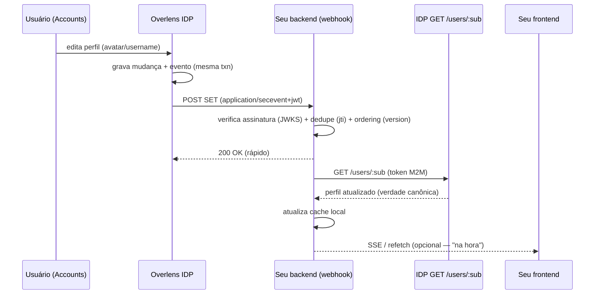

# Como implementar o webhook de atualização de dados do usuário (Overlens IDP)

> **Público:** engenheiros de um app cliente (client) do ecossistema Overlens que **cacheiam**
> atributos globais de identidade (`name`, `username`, `avatar`, `phone`, `birthDate`) e querem
> que uma edição feita no IDP apareça no app **em segundos**, sem baixar o TTL do cache nem
> bater no IDP a cada request.
>
> Este é o **passo a passo de implementação**, com código de referência pronto. Para o
> **contrato resumido** (formato do SET, tipos de evento, garantias), veja
> [`profile-events.md`](./profile-events.md). Base normativa: [RFC-0004](https://github.com/overlens/identity-provider/blob/main/docs/rfc/0004-push-eventos-de-perfil.md).
>
> **Última atualização:** 2026-07-18

> ⚠️ **Status de rollout:** a implementação no IDP está **completa**, mas a **entrega dos eventos é controlada pelo kill-switch `PROFILE_EVENTS_ENABLED` (default: desligado)** — o outbox grava sempre, o worker só entrega com a flag ligada. **Confirme com o time do IDP se o Push está ativo no ambiente** antes de depender dele; o fallback é o Pull com TTL de 300s (ADR-0009).

---

## 1. TL;DR — o que você vai construir

Um endpoint HTTP no **backend** do seu app que:

1. **Recebe** um `POST` do IDP com um evento assinado (um JWT no formato *Security Event Token*).
2. **Verifica** a assinatura com a chave pública do IDP (a mesma que você já usa para validar o access token).
3. **Deduplica** e **ordena** o evento.
4. **Invalida** o cache local daquele usuário e **re-puxa** a verdade em `GET /users/:sub`.
5. Responde **2xx rápido**.

> **Princípio central:** o evento é uma **notificação, não um dado**. Ele diz *"o usuário X mudou"* — **nunca** carrega o novo valor. A verdade vem sempre do `GET /users/:sub` (Pull). Isso torna o sistema robusto: **perder um evento não corrompe nada** — o TTL do seu cache é a rede de segurança.



---

## 2. Pré-requisitos

1. **Um OAuth client M2M** capaz de chamar `GET /users/:sub` (grant `client_credentials`, scope **`profile:read`**). Ver [`m2m-profile-read.md`](./m2m-profile-read.md). O mesmo scope **habilita** o recebimento de eventos — *só recebe evento de perfil quem já pode ler perfil*.
2. **Um endpoint HTTPS público** para receber os POSTs (ex.: `https://api.seuapp.com.br/webhooks/idp`).
3. **Registrar o webhook** no seu client (feito por um admin do IDP), via [`PATCH /admin/clients/:id`](./oauth-clients.md):

```jsonc
{
  "webhookUrl": "https://api.seuapp.com.br/webhooks/idp", // HTTPS obrigatório (anti-SSRF: sem loopback/privado/metadata)
  "webhookSecret": "um-segredo-forte-e-aleatorio"          // opcional — habilita o header HMAC de pré-filtro
}
```

> `webhookUrl: ""` remove o webhook. Definir uma URL nova **re-arma** o circuit-breaker (ver §9).

---

## 3. Anatomia do que chega no seu endpoint

`POST {webhookUrl}` com header `Content-Type: application/secevent+jwt`. O **corpo é um JWT** (string) — um *Security Event Token* (SET, RFC 8417) assinado em **RS256**.

**Header do JWT:**
```jsonc
{ "alg": "RS256", "kid": "<kid da chave do IDP>", "typ": "secevent+jwt" }
```

**Payload (decodificado):**
```jsonc
{
  "iss": "https://idp.overlens.com.br",     // emissor — valide
  "aud": "seu-client-id",                    // = o SEU clientId — valide
  "iat": 1751990400,                         // emitido em (epoch s)
  "jti": "ckdelivery...",                     // idempotency key — ESTÁVEL entre retries
  "sub_id": { "format": "opaque", "id": "ckuser..." },  // o usuário afetado (o "sub")
  "events": {
    "https://schemas.overlens.com.br/events/profile-updated": {
      "version": 1751990400000,              // monotônico por usuário — use para ordenar
      "changed": ["avatar", "name"],          // dica dos campos (ausente em lifecycle)
      "occurred_at": 1751990400
    }
  }
}
```

**Tipos de evento** (a chave em `events` é a URI; o sufixo importa):

| URI (sufixo em `.../events/`) | Quando | `changed` | O que fazer |
|---|---|---|---|
| `profile-updated` | `name`/`username`/`avatar`/`phone`/`birthDate` mudaram | lista de campos | invalidar + re-puxar |
| `account-deactivated` | conta desativada | — | invalidar (pode ocultar o usuário) |
| `account-deleted` | conta excluída (o Pull passa a dar `404`) | — | **remover** do cache |

> Não há `exp` no SET (é um evento, não uma sessão). A proteção contra replay é o par **`jti` (dedupe) + `version` (ordering)** — §5.4 e §5.5.

---

## 4. As 6 regras que o seu receiver DEVE seguir

1. **Verifique a assinatura** via o JWKS do IDP (RS256) + `iss` + `aud == seu clientId`. **Nunca** processe um SET não verificado.
2. **Leia o corpo cru** (raw string) — você precisa do texto exato para verificar a assinatura (e o HMAC, se usar).
3. **Deduplique por `jti`** (retries reusam o mesmo `jti`).
4. **Ordene por `version`** (ignore eventos com `version` menor que o último visto para aquele usuário).
5. **Responda 2xx rápido** e faça o trabalho pesado **async** (não segure a conexão do IDP).
6. **Nunca confie no payload como dado** — sempre re-puxe `GET /users/:sub` para obter o valor real.

Falhar/perder um evento **degrada para o comportamento do cache com TTL** — não corrompe. Responder não-2xx faz o IDP **re-tentar** (com backoff).

---

## 5. Implementação de referência — Node.js + Express

Usando [`jose`](https://github.com/panva/jose) para verificar RS256 via JWKS remoto (com cache automático de chaves).

```bash
npm i jose express
```

```ts
// webhook-idp.ts
import express from 'express';
import { createRemoteJWKSet, jwtVerify } from 'jose';
import { createHmac, timingSafeEqual } from 'node:crypto';

const IDP_ISSUER = 'https://idp.overlens.com.br';
const CLIENT_ID = process.env.OVERLENS_CLIENT_ID!;          // o SEU clientId (== aud esperado)
const WEBHOOK_SECRET = process.env.OVERLENS_WEBHOOK_SECRET;  // opcional (pré-filtro HMAC)

// JWKS remoto com cache + rotação automática de chave (busca por kid sob demanda).
const JWKS = createRemoteJWKSet(new URL(`${IDP_ISSUER}/.well-known/jwks.json`));

const router = express.Router();

// IMPORTANTE: corpo CRU. O SET é um JWT em text/plain-ish — não use express.json() aqui.
router.post(
  '/webhooks/idp',
  express.text({ type: 'application/secevent+jwt' }),
  async (req, res) => {
    const raw = req.body as string;

    // (opcional) pré-filtro HMAC — barra ruído antes de gastar CPU verificando RS256.
    if (WEBHOOK_SECRET && !hmacOk(raw, req.header('X-Overlens-Signature'), WEBHOOK_SECRET)) {
      return res.status(401).end();
    }

    // 1. Verifica assinatura + iss + aud. jose acha a chave pelo `kid` no JWKS (cacheado).
    let payload: SetPayload;
    try {
      ({ payload } = (await jwtVerify(raw, JWKS, {
        issuer: IDP_ISSUER,
        audience: CLIENT_ID,
      })) as unknown as { payload: SetPayload });
    } catch {
      return res.status(401).end(); // assinatura/iss/aud inválidos
    }

    const sub = payload.sub_id.id;
    const [eventUri, event] = Object.entries(payload.events)[0];
    const version = event.version;

    // 2. Idempotência (dedupe por jti). Troque o Set por Redis com TTL em produção.
    if (await alreadySeen(payload.jti)) return res.status(200).end();

    // 3. Ordering (ignore eventos velhos por usuário).
    if (version < (await lastVersion(sub))) {
      await markSeen(payload.jti);
      return res.status(200).end();
    }

    // 4. Responde ANTES de processar (2xx rápido).
    res.status(202).end();

    // 5. Processa async: dedupe/ordering persistidos + invalidar cache + re-pull.
    await markSeen(payload.jti);
    await setLastVersion(sub, version);
    if (eventUri.endsWith('/account-deleted')) {
      await evictProfile(sub);          // remove do cache
    } else {
      await refreshProfile(sub);        // GET /users/:sub (RFC-0002) e atualiza o cache
    }
  },
);

function hmacOk(raw: string, header: string | undefined, secret: string): boolean {
  if (!header) return false;
  const expected = `sha256=${createHmac('sha256', secret).update(raw).digest('hex')}`;
  const a = Buffer.from(expected);
  const b = Buffer.from(header);
  return a.length === b.length && timingSafeEqual(a, b);
}

interface SetPayload {
  jti: string;
  sub_id: { format: string; id: string };
  events: Record<string, { version: number; changed?: string[]; occurred_at: number }>;
}

export default router;
```

O `refreshProfile(sub)` reusa seu cliente M2M do [`m2m-profile-read.md`](./m2m-profile-read.md):

```ts
async function refreshProfile(sub: string) {
  const token = await getM2MToken(['profile:read']); // cacheie o token por expires_in
  const res = await fetch(`${IDP_ISSUER}/users/${sub}`, {
    headers: { Authorization: `Bearer ${token}` },
  });
  if (res.status === 404) return evictProfile(sub); // conta sumiu
  if (!res.ok) throw new Error(`profile read failed: ${res.status}`);
  const profile = await res.json();
  await cachePut(sub, profile); // seu cache local (Redis/memória) com o TTL de sempre
}
```

---

## 6. Implementação de referência — NestJS

O SET precisa do **corpo cru**. Habilite `rawBody` no bootstrap e leia via `req.rawBody`.

```ts
// main.ts
const app = await NestFactory.create(AppModule, { rawBody: true });
```

```ts
// idp-webhook.controller.ts
import { Controller, Post, Req, Res, HttpCode } from '@nestjs/common';
import type { Request, Response } from 'express';
import { createRemoteJWKSet, jwtVerify } from 'jose';

const IDP_ISSUER = 'https://idp.overlens.com.br';
const JWKS = createRemoteJWKSet(new URL(`${IDP_ISSUER}/.well-known/jwks.json`));

@Controller('webhooks')
export class IdpWebhookController {
  constructor(private readonly profiles: ProfileCacheService) {}

  @Post('idp')
  @HttpCode(202)
  async handle(@Req() req: Request, @Res({ passthrough: true }) res: Response) {
    const raw = (req as Request & { rawBody?: Buffer }).rawBody?.toString('utf8') ?? '';

    let payload: SetPayload;
    try {
      ({ payload } = (await jwtVerify(raw, JWKS, {
        issuer: IDP_ISSUER,
        audience: process.env.OVERLENS_CLIENT_ID,
      })) as unknown as { payload: SetPayload });
    } catch {
      res.status(401);
      return;
    }

    const sub = payload.sub_id.id;
    const event = Object.values(payload.events)[0];

    if (await this.profiles.seen(payload.jti)) return;
    if (event.version < (await this.profiles.lastVersion(sub))) return;

    // ack já foi 202; agenda o processamento (queue) sem segurar a resposta.
    await this.profiles.enqueueRefresh(sub, payload.jti, event.version);
  }
}
```

> Dica: em produção, empurre `enqueueRefresh` para uma fila (BullMQ, SQS) e faça o dedupe/ordering/re-pull no worker. O controller só valida e enfileira.

---

## 7. Verificação da assinatura — o que exatamente checar

| Checagem | Por quê |
|---|---|
| Assinatura **RS256** válida contra a chave do JWKS (`kid` do header) | prova que veio do IDP |
| `iss == https://idp.overlens.com.br` | evita tokens de outro emissor |
| `aud == seu clientId` | evita reaproveitar um SET destinado a outro client |
| (recomendado) rejeitar `alg` != `RS256` | blinda algorithm-confusion |
| (recomendado) `iat` dentro de uma janela (ex.: ±10 min) | reduz janela de replay |

Bibliotecas recomendadas por stack: **Node** `jose` · **Python** `PyJWT` + `PyJWKClient` · **Go** `github.com/lestrrat-go/jwx/v2/jwt` + `jwk` · **Java** `nimbus-jose-jwt`. Todas suportam JWKS remoto com cache por `kid` — **não** implemente verificação de RSA na mão.

> **Rotação de chave:** o IDP pode rotacionar o keypair; o `kid` no header muda junto. Clientes que cacheiam o JWKS devem **re-buscar** quando encontram um `kid` desconhecido (as libs acima já fazem isso). Não fixe uma chave estática.

---

## 8. Idempotência e ordering (o estado que você precisa guardar)

- **Dedupe (`jti`)**: guarde os `jti` já processados por uma janela (**24h** é suficiente — retries acontecem em minutos). Em produção, **Redis** `SET jti 1 EX 86400 NX` é ideal: o `NX` te diz se é novo em uma operação atômica.
- **Ordering (`version` por `sub`)**: guarde a maior `version` vista por usuário. Ignore eventos com `version` estritamente menor. Como o Pull sempre traz o estado **atual**, empates/atrasos são inofensivos (no pior caso, um re-pull redundante).

```ts
// Redis — exemplo de dedupe atômico
async function alreadySeen(jti: string): Promise<boolean> {
  const isNew = await redis.set(`idp:evt:${jti}`, '1', 'EX', 86400, 'NX');
  return isNew === null; // null => já existia
}
```

---

## 9. O que o IDP faz na entrega (e o que isso exige de você)

- **At-least-once:** o mesmo evento pode chegar mais de uma vez (mesmo `jti`) → **dedupe é obrigatório**.
- **Retry + backoff:** respostas não-2xx ou timeout são reagendadas com backoff exponencial. **Responda 2xx só depois de aceitar** o evento (validado + enfileirado/persistido).
- **Dead-letter + circuit-breaker:** falhas persistentes viram dead-letter e, após recorrência, o IDP **desativa** o seu webhook (`webhookDisabledAt`) para não martelar um endpoint morto. **Para re-armar:** peça ao admin para re-salvar a `webhookUrl` (isso zera o circuit-breaker).
- **Cold start / offline:** **não há replay histórico**. Ao voltar, seu cache expira por TTL e o `GET /users/:sub` traz o estado atual. Eventos perdidos não causam dano permanente.

---

## 10. Segurança — checklist

- [ ] **Sempre** verifique a assinatura (JWKS/RS256) + `iss` + `aud`. Trate o corpo como não-confiável até verificar.
- [ ] Use o **corpo cru** para verificar (e para o HMAC) — reserializar quebra a assinatura.
- [ ] **Nunca** use valores do payload como dado do usuário — só `sub`/`version`/`changed`. O valor vem do Pull.
- [ ] Endpoint em **HTTPS**; responda igual (`2xx`/`401`) para não vazar detalhes.
- [ ] (Opcional) valide o **HMAC** `X-Overlens-Signature` com `timingSafeEqual` como pré-filtro barato.
- [ ] Proteção de replay: **dedupe por `jti`** + ordering por `version` (+ janela de `iat` opcional).

---

## 11. Testando seu webhook

**a) Unit test da verificação (sem rede).** Gere um keypair RSA de teste, exponha um JWKS falso e assine um SET você mesmo — assim você testa o handler offline:

```ts
import { generateKeyPair, exportJWK, SignJWT } from 'jose';

const { privateKey, publicKey } = await generateKeyPair('RS256');
// injete um JWKS local { keys: [{ ...await exportJWK(publicKey), kid, alg:'RS256', use:'sig' }] }
const set = await new SignJWT({
  jti: 'evt_test_1',
  sub_id: { format: 'opaque', id: 'ckuser1' },
  events: { 'https://schemas.overlens.com.br/events/profile-updated': { version: 1, changed: ['avatar'], occurred_at: 1 } },
})
  .setProtectedHeader({ alg: 'RS256', kid: 'test-kid', typ: 'secevent+jwt' })
  .setIssuer('https://idp.overlens.com.br')
  .setAudience('seu-client-id')
  .setIssuedAt()
  .sign(privateKey);
// POST `set` no seu endpoint e asserte: 2xx, cache invalidado, re-pull chamado, dedupe no 2º POST.
```

Cubra: assinatura válida → processa; **assinatura inválida → 401**; **aud errado → 401**; **`jti` repetido → não re-processa**; **`version` menor → ignora**; `account-deleted` → evict.

**b) Smoke em staging.** Registre a `webhookUrl` apontando para um túnel (ex.: `ngrok`, `webhook.site`), edite um perfil no IDP de staging e confirme que o POST chega e verifica.

---

## 12. Observabilidade (no seu lado)

Logue por evento: `jti`, `sub`, tipo, resultado (`verified`/`rejected`/`deduped`/`stale`/`processed`), e a latência do re-pull. Alerte em: taxa de `rejected` > 0 (config/rotação de chave), atraso de processamento, e falhas de `GET /users/:sub`.

---

## 13. Troubleshooting

| Sintoma | Causa provável | Correção |
|---|---|---|
| `401` / assinatura inválida em tudo | corpo re-serializado (perdeu bytes) ou `aud` errado | use o corpo **cru**; confira `aud == seu clientId` |
| `kid not found` no JWKS | chave rotacionada e JWKS em cache velho | use lib com re-fetch por `kid` (jose/PyJWKClient já fazem) |
| Eventos param de chegar | circuit-breaker desativou o webhook após dead-letters | corrija o endpoint; peça re-salvar a `webhookUrl` (re-arma) |
| Dados “piscam” velho→novo | processando o payload como dado, ou ordering ausente | **sempre** re-puxe; aplique ordering por `version` |
| Recebe o mesmo evento 2x | at-least-once (normal) | dedupe por `jti` |
| Usuário não vê “na hora” | falta o último salto backend→browser | adicione SSE/refetch (é responsabilidade do client) |

---

## 14. Checklist de entrega

- [ ] Endpoint HTTPS com **corpo cru** (`application/secevent+jwt`).
- [ ] Verificação **JWKS/RS256** + `iss` + `aud`.
- [ ] (Opcional) pré-filtro **HMAC** com `timingSafeEqual`.
- [ ] **Dedupe** por `jti` + **ordering** por `version` (persistidos).
- [ ] **2xx rápido**, processamento **async**.
- [ ] Invalidar cache + **re-pull** `GET /users/:sub` (evict em `account-deleted`).
- [ ] (Opcional) empurrar ao browser via SSE/refetch.
- [ ] Testes: assinatura inválida, `aud` errado, `jti` repetido, `version` menor, `account-deleted`.

---

**Referências:** [RFC-0004](https://github.com/overlens/identity-provider/blob/main/docs/rfc/0004-push-eventos-de-perfil.md) · contrato resumido em [`profile-events.md`](./profile-events.md) · Pull em [`m2m-profile-read.md`](./m2m-profile-read.md) · validação de JWT/JWKS em [`backend.md`](./backend.md).
